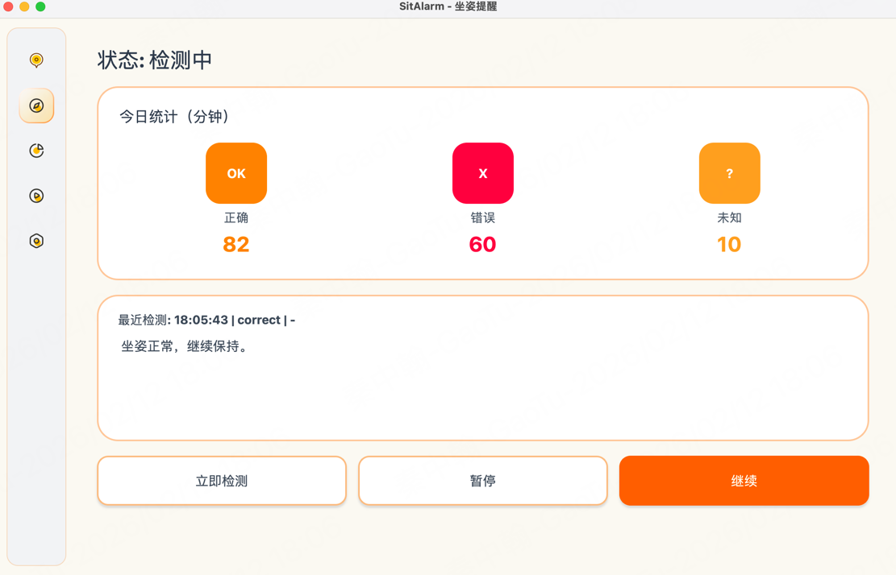
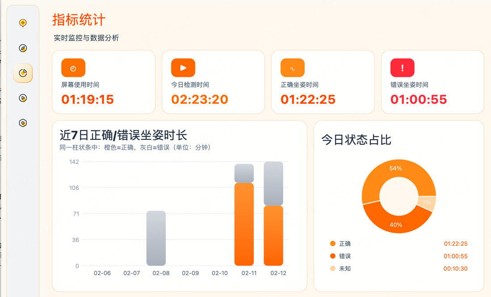

# SitAlarm

一个基于 Python + PyQt5 的本地坐姿提醒软件，支持定时抓拍、姿势提醒、当天图片归档、正确坐姿时长统计。

> **⚠️ 系统支持说明**
> 
> **当前版本仅支持 macOS（MacBook / iMac / Mac Studio 等）**
> 
> Windows 支持正在开发中，敬请期待。

## 功能

- 定时抓拍（1~300 秒可配置，含黑屏/暗帧自动重试）
- 头占比坐姿识别（头部占画面比例过大判定为错误坐姿）
- 首次使用引导校准（拍 2 张正确坐姿照片，自动计算每台设备阈值）
- 摄像头调试页实时预览（自动开启，显示头框、头占比、姿态判定）
- 坐姿错误时托盘提醒 + 桌面弹窗提醒
- Vision 风格半透明磨砂主题（乳白色科技感 UI）
- 自定义软件 Logo（窗口与托盘图标）
- 可选屏幕超时提醒
- 当天图片按日期目录存储，本地可查看
- 今日与近 7 天坐姿统计图表
- 所有数据本地存储（SQLite + 本地图片）



## 系统要求

| 项目 | 要求 |
|------|------|
| **操作系统** | **macOS 11.0+** (目前仅支持 Mac) |
| Python 版本 | 3.9+ |
| 硬件 | 带摄像头的 MacBook / iMac / Mac Studio |

## 安装依赖

```bash
pip install -r requirements.txt
```

## 启动

```bash
python main.py
```

## 首次使用（引导流程）

软件首次启动会自动进入引导页面：

1. **拍摄校准照片**：拍摄 2 张正确坐姿照片，系统自动计算阈值
2. **预览检测效果**：在引导页查看实时检测画面
3. **配置检测参数**：设置检测间隔、提醒方式等
4. **开始使用**：点击"开始检测"启动坐姿监测

> 后续可随时点击左侧边栏的"引导"图标重新进入引导流程。

### 校准说明

阈值计算方式：
- 取两张正确姿势样本的**最大头占比**；
- 阈值 = 最大头占比 × **1.15**（安全余量）。

正确坐姿要点：
- 头部正直，耳朵与肩膀保持垂直
- 眼睛与屏幕保持适当距离（约50-70cm）
- 肩膀放松，背部挺直

## 调试页说明

- 切换到"摄像头调试"页后，会自动开启实时画面预览。
- 实时画面会叠加：
  - 头部画框
  - 当前头占比
  - 阈值触发状态（correct / incorrect / unknown）
- 点击"抓拍调试（保存图片）"可将当前帧保存到当天目录并更新调试详情。

## 本地数据位置

- 图片目录：`~/Pictures/SitAlarm/YYYY-MM-DD/`
- 数据库：`~/.sitalarm/sitalarm.db`

## 开发计划

- [ ] Windows 系统支持
- [ ] 更多提醒方式（声音、震动）
- [ ] 姿势检测算法优化
- [ ] 云端数据同步（可选）
